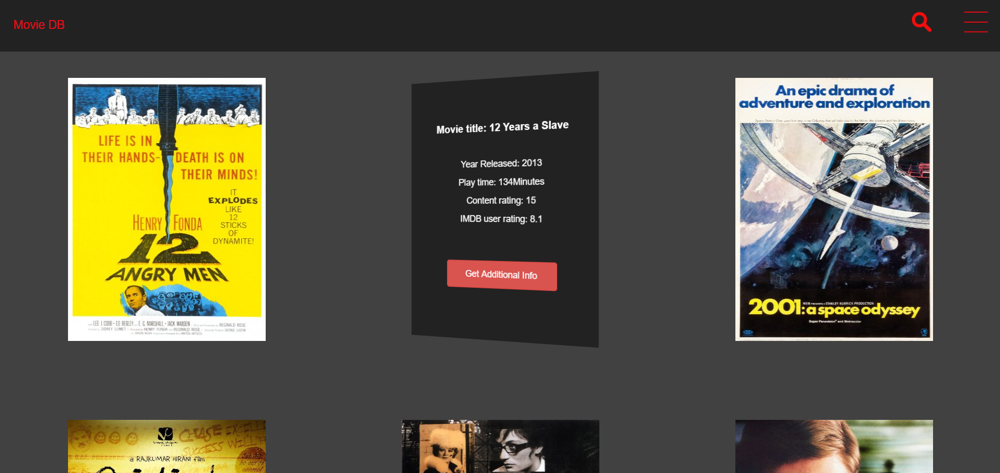
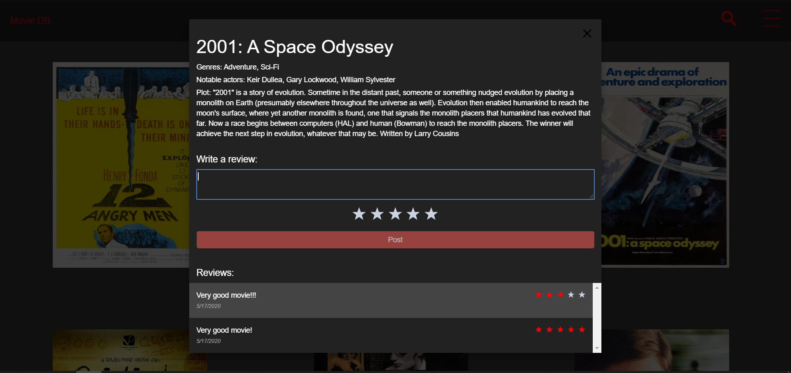
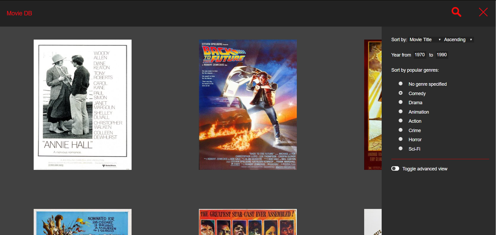
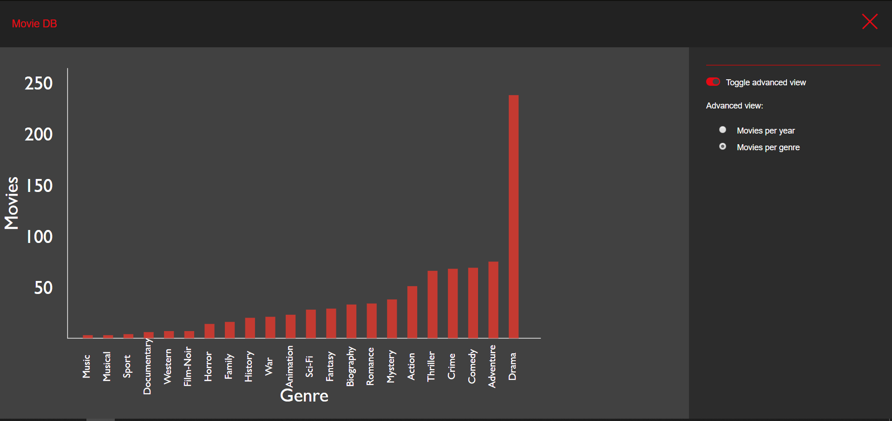

<div align="center">
<h1>
MovieDB
</h1>
<br>
MovieDB is a react (or react-native) application where you can browse hundreds of different movies (data is from https://github.com/FEND16/movie-json-data). We are using graphql as our API. Features include sorting, filtering, searching, infinite scroll, graph of the data.
<br>
<br>
<p align="center">
  <a href="#getting-started">Getting started</a> •
  <a href="#running-tests">Running tests</a> •
  <a href="#pictures">Pictures</a>
</p>
</div>

---

# Getting started

Our application is divided into three main parts; a mongodb database, an express backend, and either a react frontend or react-native frontend.

These instructions will get you a copy of the project up and running on your local machine for development and testing purposes.

### Prerequisites

- [NodeJS](https://nodejs.org/en/)
- [MongoDB community edition](https://docs.mongodb.com/manual/installation/)

```bash
# Clone this repository
$ git clone https://gitlab.stud.idi.ntnu.no/tdt4140-2020/67.git
```

### Setting up database

We have made a script which will set up the database for you. Under is an example of how to set it up properly.

1. Move the `database_setup.js` file from this project folder to `C:\Program Files\MongoDB\Server\4.2\bin` (or wherever your mongodb folder is on your system).
2. Enter `C:\Program Files\MongoDB\Server\4.2\bin` using the file explorer, and double click on mongo.exe.
3. Run the command `use it2810`
4. Run the command `load("database_setup.js")` (This only works if step 1 is done, since it requires that the file is in the same folder as mongodb)

You should now have the database running locally on your system.

### Setting up backend

```bash
# Navigate to the backend folder
$ cd NTNU-IT2810-moviedb/backend

# Install the node dependencies
$ yarn

# Start the express server
$ yarn start
```

### Setting up frontend

```bash
# Navigate to the frontend folder
$ cd NTNU-IT2810-moviedb/frontend

# Install the node dependencies
$ yarn

# Runs the website on localhost
$ yarn start
```

### Setting up frontend (react-native for mobile)

```bash
# Install expo-cli globally
$ npm install -g expo-cli

# Navigate to the frontend folder
$ cd NTNU-IT2810-moviedb/frontend-native

# Install the node dependencies
$ yarn

# Start the Expo server
$ yarn start
```

The console should now show a QR code.

- If you are using an Android device, you can scan the QR code using the [expo app for android](https://play.google.com/store/apps/details?id=host.exp.exponent&hl=en).
- If you are using an Iphone you can scan the QR code using your Apple Camera App, but you need the [expo app for Iphone](https://apps.apple.com/us/app/expo-client/id982107779) installed.

**Note that when this project was created, we were hosting the database at NTNU, so for react-native to work properly, you need to run the express backend server on a specific ip adress, and change the ip adress at `frontend-native/serverURL.js` to that ip adress**

# Running tests

### Unit test

```bash
# Navigate to the backend folder
$ cd NTNU-IT2810-moviedb/backend

# Run the unit tests
$ yarn test
```

### Cypress automatic E2E test

```bash
# Navigate to the frontend folder
$ cd NTNU-IT2810-moviedb/frontend

# Run the test
$ yarn test:cypress
```

When the cypress consol opens, click on App.e2e.js, the test should now run.

**Note that you need to have both the frontend and backend running locally for this test to work**

# Pictures

This is the main page. Hover over a movie to get more details (like the one in the middle)


<br>

When you click on the "get additional info" button, you get this screen, and you can add reviews etc.


<br>

In the drawer you can filter and sort, and also get to the advanced view (next picture).


<br>

Here is the advanced view, with a graph of how many different movies there are per genre in our database.

